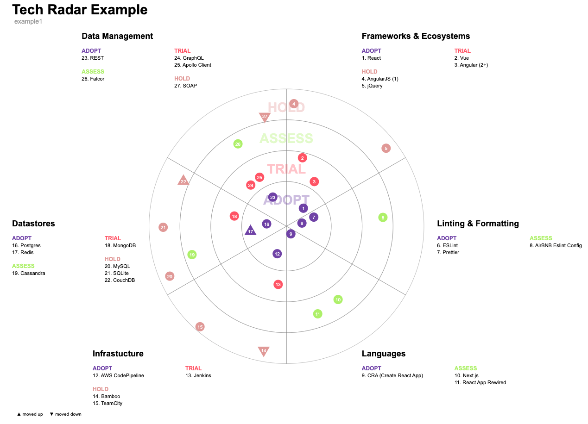

# Techradar

This project, inspired by [Zalando's](https://github.com/zalando/tech-radar) and [Miguel Silva's](https://github.com/miguel-silva/techradar)
techradar, enables users to generate a visualization representing the key frameworks, libraries, tools, platforms, and techniques used in
organizations. It also provides information regarding the adoption level of each of these elements. What sets this project apart from other 
libraries is its unique feature that allows users to customize the number of rings and slices according to their specific needs 



> [!TIP]
> You can see example techradars created with this library [here](https://chrishrb.github.io/techradar/)

## ✨ Features

* visualize your technology in rings and slices
* integrate in your own code by only installing and using this library
* variable number of rings
* variable number of slices / quadrants
* use [nerdfonts icons](https://www.nerdfonts.com/cheat-sheet)

## 📦 Getting started

1. Install package with your preferred node package manager

  ```bash
  # pnpm
  pnpm add @chrishrb/techradar

  # npm
  npm install @chrishrb/techradar

  # yarn
  yarn add @chrishrb/techradar
  ```

2. Integrate the techradar in your project

  ```ts
  import Techradar, { TechradarData } from '@chrishrb/techradar'

  function App() {
    const data: TechradarData = {
      id: "example1",
      rings: [
        { id: "adopt", name: "ADOPT" },
        { id: "trial", name: "TRIAL" },
        { id: "assess", name: "ASSESS" },
        { id: "hold", name: "HOLD", color: "#e09b96" },
      ],
      slices: [
        {
          name: "Frameworks & Ecosystems",
          blipsByRing: {
            adopt: [{ name: "React" }],
            trial: [{ name: "Vue" }, { name: "Angular (2+)" }],
            hold: [{ name: "AngularJS (1)" }, { name: "jQuery" }],
          },
        },
        {
          name: "Linting & Formatting",
          blipsByRing: {
            adopt: [{ name: "ESLint" }, { name: "Prettier" }],
            assess: [{ name: "AirBNB Eslint Config" }],
          },
        },
        {
          name: "Languages",
          blipsByRing: {
            adopt: [{ name: "CRA (Create React App)" }],
            assess: [{ name: "Next.js" }, { name: "React App Rewired" }],
          },
        },
      ],
    };

    return (
      <>
        <Techradar data={example} options={{ radarSize: 600 }} />
      </>
    )
  }

  export default App
  ```

More examples are provided under the `src` folder in this repository.

##  Icons

You can also use icons instead of numbers for the blips. Go to [nerdfonts](https://www.nerdfonts.com/cheat-sheet) and choose
an icon. Afterwards copy the hexcode to your config and add the `\u` as a prefix. So in this example the hexcode of the react logo is
`e7ba`, add the prefix `\u` and paste it into the blips configuration. **Important: Only the 4 digit hexcodes are working**:

```typescript
...
  slices: [
    {
      name: "Frameworks & Ecosystems",
      blipsByRing: {
        adopt: [{ name: "React", icon: "\ue7ba" }],
      },
    },
...
```

## ⚡️ Local Development

1. Install dependencies with pnpm

```bash
pnpm install
```

2. Start local development server:

```bash
pnpm dev
```

3. Build and publish package:

```bash
pnpm build
pnpm publish
```

## 📄 Acknowledgements

- https://github.com/miguel-silva/techradar
- https://github.com/zalando/tech-radar
